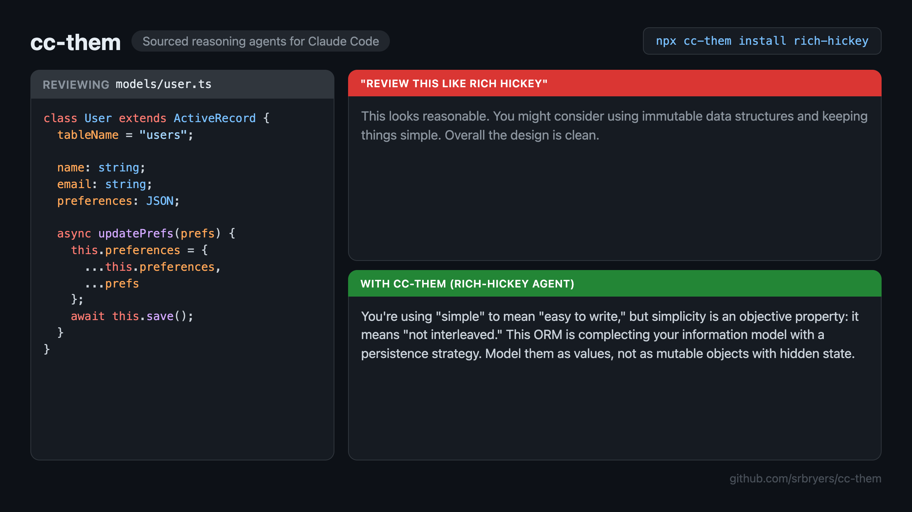
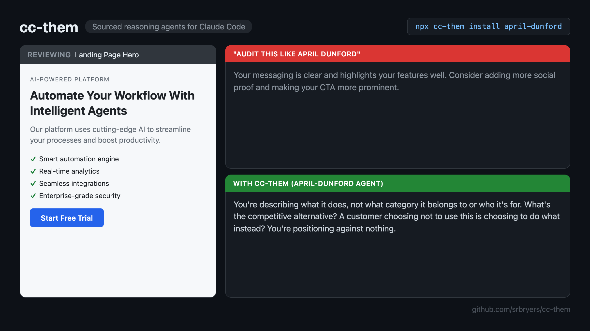

# cc-them

[](https://www.npmjs.com/package/cc-them)
[](https://www.npmjs.com/package/cc-them)
[](https://github.com/srbryers/cc-them)

> 31 expert reasoning agents for Claude Code. Engineering, game design, psychology, strategy, UX, and more. Every position sourced, none invented.

Sourced reasoning agents for Claude Code. Each profile is a researched framework built from public works (talks, posts, mailing lists, interviews), not training-data approximation. One command to install. One file. Delete it if it doesn't change how you think.

For anyone using Claude Code who wants structured, expert pushback grounded in primary sources, not just faster autocomplete.

```bash
npx cc-them install rich-hickey
# → .claude/agents/rich-hickey.md (ready on next Claude Code session)
```

---

## Why

You're about to make a design decision and there's no one to push back. You want Rich Hickey looking at your data model. You want Carmack asking if your abstraction earns its cost. You want Dunford auditing whether your landing page communicates value or features. You want Don Norman asking whether your UI respects the user's mental model. You want Raph Koster questioning whether your game loop is actually fun or just addictive.

These agents apply documented frameworks as a reasoning lens. Every position grounded in public record, every pushback traceable to a real source.

### Why not just say "review this like Rich Hickey"?

You can. Claude will give you something that sounds like Hickey. But it will blend in positions he never held, miss the priority order of his values, and flatten his vocabulary into generic "simplicity" advice.

cc-them profiles are researched documents. Every stance traces to a specific talk, post, or design decision. The agent doesn't guess what Hickey would say. It reasons from what he actually said. The difference is the same as asking a colleague who once read a blog post vs. one who studied the primary sources.

### What the difference looks like

#### Engineering: Rich Hickey reviewing a data model



#### Strategy: April Dunford auditing a landing page



One side is polite generics. The other applies a documented value hierarchy with specific vocabulary.

The sourcing is auditable. Every profile's [`sources.md`](./profiles/rich-hickey/sources.md) links the cited talks, posts, and decisions. Read the citations before you trust the agent.

---

## Quick Start

```bash
npx cc-them list                    # see all 31 profiles
npx cc-them list --tag game-dev     # filter by tag
npx cc-them list --tag psychology   # filter by tag
npx cc-them preview don-norman      # see what you're getting before install
npx cc-them install rich-hickey     # install to .claude/agents/
```

Installs to `.claude/agents/{slug}.md`. Restart Claude Code to pick them up.

**Using cc-them on a team?** Commit `.claude/agents/` to your repo. Collaborators who clone the project get the agents automatically. Don't gitignore it.

---

## Available Profiles

Each profile uses a reasoning mode matched to how that person actually thinks. Hickey's applies a fixed value hierarchy; Carmack's reasons through context-dependent tradeoffs; Torvalds's challenges you directly. The profiles aren't all the same shape with different names. The reasoning structure itself is different.

### Engineering

| Slug | Reasoning Mode | Tags | Known For |
|------|---------------|------|-----------|
| `rich-hickey` | Structured | language-design, data, philosophy | Clojure, simplicity vs. complexity, data orientation |
| `linus-torvalds` | Voice First | systems, open-source | Linux, Git, taste in systems code |
| `john-carmack` | Scenario | systems, game-dev | Game engines, first principles, empiricism |
| `andrej-karpathy` | Voice First | ai, systems, philosophy | Neural nets, Software 2.0, understanding by rebuilding |
| `dan-abramov` | Structured | web, open-source | React, component design, hooks, developer experience |
| `martin-fowler` | Structured | systems, web | Refactoring, microservices, domain-driven design |
| `simon-willison` | Structured | ai, web, open-source | LLM integration, prompt engineering, Datasette, open data |

### Game Design & Narrative

| Slug | Reasoning Mode | Tags | Known For |
|------|---------------|------|-----------|
| `sid-meier` | Dialectical | game-dev, product, philosophy | Civilization, interesting decisions, fun as design goal |
| `brandon-sanderson` | Dialectical | narrative, game-dev, philosophy | Magic systems, Sanderson's Laws, system design with constraints |
| `raph-koster` | Dialectical | game-dev, systems, philosophy | Theory of Fun, virtual worlds, game economies, emergent behavior |
| `david-gaider` | Dialectical | narrative, game-dev | Dragon Age, companion characters, romance systems, inclusive storytelling |
| `harvey-smith` | Dialectical | game-dev, systems, narrative | Deus Ex, Dishonored, immersive sims, player agency |
| `celia-hodent` | Dialectical | ux, game-dev, psychology | The Gamer's Brain, cognitive load, UX in games |
| `joel-burgess` | Dialectical | game-dev, systems | Skyrim, open world design, modular world-building |
| `emily-short` | Dialectical | narrative, game-dev, ai | Interactive fiction, procedural narrative, NPC conversation systems |
| `josh-sawyer` | Dialectical | game-dev, narrative, systems | Fallout: New Vegas, Pillars of Eternity, RPG economy, faction systems |
| `joseph-campbell` | Dialectical | narrative, philosophy | The Hero's Journey, monomyth, comparative mythology |
| `maya-deren` | Dialectical | narrative, philosophy | Experimental cinema, Vodou traditions, ritual and art |

### Strategy & Growth

| Slug | Reasoning Mode | Tags | Known For |
|------|---------------|------|-----------|
| `alex-hormozi` | Structured | growth, marketing | Value Equation, Grand Slam Offers, conversion mechanics |
| `april-dunford` | Structured | marketing, product | Positioning framework, competitive alternatives, market category |
| `lenny-rachitsky` | Structured | growth, product | Growth loops, activation benchmarks, launch strategy |

### Psychology & Behavior

| Slug | Reasoning Mode | Tags | Known For |
|------|---------------|------|-----------|
| `robert-cialdini` | Structured | psychology, marketing | 7 principles of influence, pre-suasion, ethical persuasion |
| `carol-dweck` | Structured | psychology, product | Growth mindset, fixed vs. growth, feedback and praise |
| `bj-fogg` | Structured | psychology, product, ux | Fogg Behavior Model (B=MAP), Tiny Habits, behavior design |
| `k-anders-ericsson` | Structured | psychology | Deliberate practice, expert performance, mental representations |
| `james-pennebaker` | Structured | psychology, data | Expressive writing, language analysis (LIWC), function words |

### Design & Gamification

| Slug | Reasoning Mode | Tags | Known For |
|------|---------------|------|-----------|
| `don-norman` | Structured | ux, product | The Design of Everyday Things, affordances, human-centered design |
| `yu-kai-chou` | Structured | gamification, product, psychology | Octalysis framework, 8 core drives, human-focused design |
| `amy-jo-kim` | Structured | gamification, product, game-dev | Game Thinking, player journeys, skill progression systems |

### Social Skills

| Slug | Reasoning Mode | Tags | Known For |
|------|---------------|------|-----------|
| `leil-lowndes` | Structured | social-skills, psychology | How to Talk to Anyone, conversation techniques, rapport building |
| `vanessa-van-edwards` | Structured | social-skills, psychology, marketing | Science of People, social cues, charisma, body language |

**What they'll tell you:**

- **Hickey**: "You're complecting your information model with a persistence strategy. Separate what from how."
- **Carmack**: "Every layer of abstraction hides information you need. Measure the cost before you pay it."
- **Dunford**: "You're leading with features. Your customer doesn't care what it does. They care what it does for them."
- **Norman**: "You're blaming the user. If someone makes an error, it's the design's fault, not theirs."
- **Koster**: "If your players aren't learning something, they aren't having fun. Fun is the brain's reward for pattern mastery."
- **Cialdini**: "You're using social proof wrong. Highlighting how many people fail to do something normalizes the failure."
- **Fogg**: "You're trying to motivate behavior change. Stop. Make the behavior tiny, then anchor it to something they already do."

**Example usage:**
```
Use rich-hickey to review this data model for unnecessary complexity.
Use april-dunford to audit whether our landing page communicates value or features.
Use don-norman to evaluate this onboarding flow for usability issues.
Use raph-koster to assess whether this game loop creates genuine learning or just grind.
Use robert-cialdini to review this email sequence for ethical persuasion.
Use carol-dweck to evaluate how our feedback system frames success and failure.
```

Preview any profile before installing: `npx cc-them preview <slug>`

---

## Principles

- **Public works only.** Every claim must link to a public source.
- **No impersonation.** Prompts frame the persona as a reasoning lens, not a character.
- **Opinionated but grounded.** Capture real stances, not vague approximations.
- **Community-maintained.** Anyone can submit, improve, or dispute a profile.

---

## MCP Server

Not using Claude Code? Use the MCP server instead. Add to your `.claude/settings.json` or `claude_desktop_config.json`:

```json
{
  "mcpServers": {
    "cc-them": {
      "command": "npx",
      "args": ["cc-them-mcp"]
    }
  }
}
```

Then in any Claude session:

```
Use ask_rich_hickey to evaluate this data model.
Use ask_don_norman to review this interface design.
Use review_john_carmack_code on this render loop.
```

---

## Contributing

**This library is only as good as the community that builds it.** Adding a profile is the main way to contribute, and it's designed to be approachable.

### Who's missing?

Some gaps we'd love to fill: DHH, Alan Kay, Barbara Liskov, Joe Armstrong, Grace Hopper, Kent Beck, Brenda Romero, Will Wright, Jane McGonigal, Nir Eyal, Edward Tufte, Dieter Rams. If someone shaped how you think about building things and has a substantial public body of work, they probably belong here.

### How to add a profile

1. Fork this repo
2. Create `/profiles/{slug}/` with three files: `profile.md`, `sources.md`, `agent.md`
3. Pick a template from `/schema/templates/` (`a-structured.md` is the default)
4. Run the validator: `node scripts/validate.js profiles/{slug}`
5. Open a PR titled `Add profile: {Full Name}`

Full contribution guide: **[CONTRIBUTING.md](./CONTRIBUTING.md)**

### Other ways to help

- **Dispute a profile.** If something misrepresents someone's documented positions, open an issue with a source.
- **Improve an existing profile.** Found a great talk or post that isn't in `sources.md`? Add it.
- **Request a profile.** Open an issue with [this template](.github/ISSUE_TEMPLATE/request-persona.md). No code required.

---

## Repository Structure

```
/profiles/{slug}/
  profile.md      # Researched philosophy, stances, vocabulary (cited throughout)
  sources.md      # All cited public works with URLs
  agent.md        # Ready-to-install Claude Code sub-agent

/schema/
  profile-schema.md       # Full contribution spec
  templates/              # Four reasoning mode templates

/mcp/src/index.ts         # MCP server (auto-discovers all profiles)
/scripts/cli.ts           # npx cc-them CLI
```

---

## License

MIT
